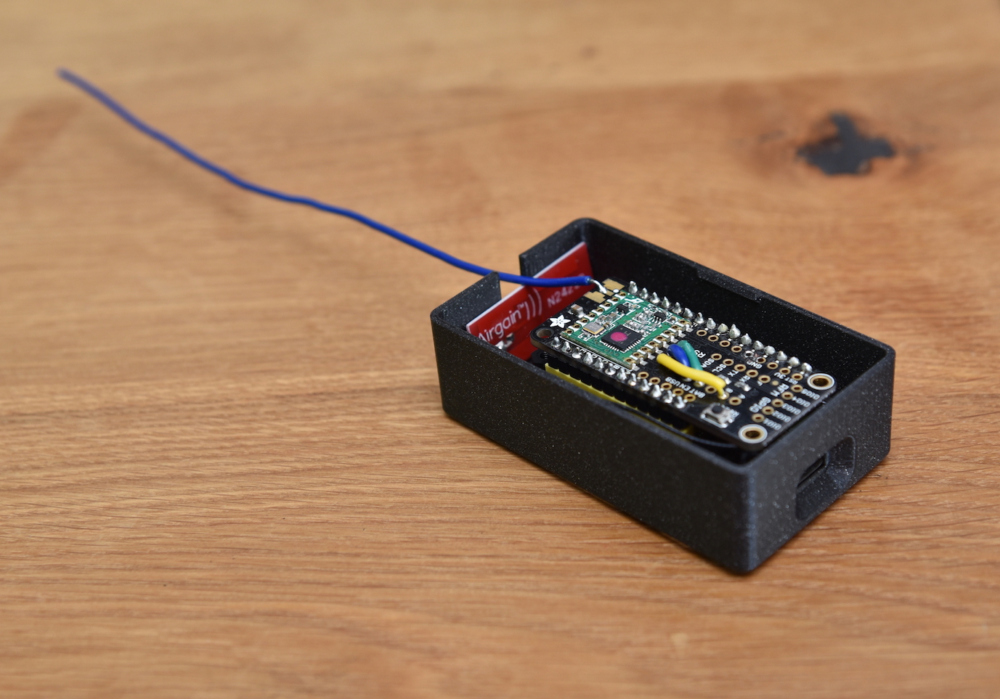

[](https://github.com/vladak/radio2mqtt/actions/workflows/python-checks.yml)

# Radio (RFM69) to MQTT gateway

Receive messages in certain format over RFM69 based radio, decode them and publish as MQTT messages using WiFi.
The code assumes Feather ESP32 V2 and certain wiring of the Radio FeatherWing.

This is the server piece for [shield](https://github.com/vladak/shield/).

## Hardware

Here is a bill of materials:

Purpose | Name
---|---
microcontroller | [ESP32 Feather V2 with w.FL antenna connector](https://www.adafruit.com/product/5438)
WiFi antenna | [WiFi Antenna with w.FL / MHF3 / IPEX3 Connector](https://www.adafruit.com/product/5445)
radio | [Radio FeatherWing 433 MHz](https://www.adafruit.com/product/3230) 

Most of the stuff comes from [Adafruit](https://www.adafruit.com/).

https://www.thingiverse.com/thing:2664919/files is used for the enclosure.

## Physical packaging

To attach the FeatherWing to the Feather, I used the [colored headers](https://www.adafruit.com/product/4160). These are not visible when the FeatherWing is attached and the assembly is in an enclosure however they add a tiny bit of fun to the project.

I used the ["tracking tag"](https://www.thingiverse.com/thing:2664919) enclosure that is originally designed for Feather M0 and GPS, however I needed something quick and this seems it would fit. It fits the WiFi antenna snuggly (the cutout could probably fit even the dipole swivel antenna together with the wire antenna) and barely fits the Radio FeatherWing - it would be nice if it was a bit higher. Also as the remix author notes, the lid is a bit too loose, so for these reasons I had to use a tape to secure the lid to the bottom box.




## Software/firmware install

Firstly, the microcontroller needs to be converted to run CircuitPython 9.x (for the `circup` to work with web workflow). To do that, for ESP32 V2, I chose the [command line `esptool`](https://learn.adafruit.com/circuitpython-with-esp32-quick-start/command-line-esptool) on a Linux computer (since macOS appeared to have flaky serial connection for some reason), however these days it can be done using [Web Flasher](https://adafruit.github.io/Adafruit_WebSerial_ESPTool/) in Chrome.

Once CicuitPython is installed, perform the initial set up by [creating the `settings.toml` file](https://learn.adafruit.com/circuitpython-with-esp32-quick-start/setting-up-web-workflow
) in the root directory (using `screen` when the board is connected via USB data cable):
```
f = open('settings.toml', 'w')
f.write('CIRCUITPY_WIFI_SSID = "wifissid"\n')
f.write('CIRCUITPY_WIFI_PASSWORD = "wifipassword"\n')
f.write('CIRCUITPY_WEB_API_PASSWORD = "XXX"\n')
f.close()
```
and restart the microcontroller.

Then the following can be used:
- copy `*.py` files to the root directory using web workflow, assumes system with `curl` installed:
  ```
  for f in *.py; do curl -v -u :XXX -T "$f" -L --location-trusted "http://172.40.0.11/fs/$f"; done
  ```
- create `secrets.py` in the root directory (using the same technique as in the previous step)
- install necessary libraries from Adafruit CircuitPython bundle to the `lib` directory using web workflow:
  ```
  circup --host 172.40.0.11 --password XXX install -r requirements.txt
  ```

## Configuration

There needs to be a `secrets.py` file that contains Wi-Fi credentials and MQTT configuration.
It can look like this:
```python
# This file is where you keep secret settings, passwords, and tokens!
# If you put them in the code you risk committing that info or sharing it

secrets = {
    "ssid": "foo",
    "password": "bar",
    "broker": "172.40.0.3",
    "broker_port": 1883,
    "allowed_topics": ["devices/terasa/shield"],
    "log_topic": "logs/terasa/radio2mqtt",
    "log_level": "INFO",
    "encryption_key": b"\x01\x02\x03\x04\x05\x06\x07\x08\x01\x02\x03\x04\x05\x06\x07\x08",
}
```

To transfer the file to the microcontroller, the same method as in the Install section should be used.

### Tunables

Purpose | Name                                                                                                                                              | Type | Kind
---|---------------------------------------------------------------------------------------------------------------------------------------------------|---|---
`ssid` | WiFi SSID                                                                                                                                         | `str` | Mandatory
`password` | WiFi password                                                                                                                                     | `str` | Mandatory
`broker` | MQTT broker address                                                                                                                               | `str` | Mandatory
`broker_port` | MQTT broker port                                                                                                                                  | `int` | Mandatory
`allowed_topics` | MQTT topics to publish messages to                                                                                                                 | `list` of `str` | Mandatory
`log_topic` | MQTT topic to publish log messages to                                                                                                             | `str` | Optional
`log_level` | log level, default `INFO`                                                                                                                         | `str` | Mandatory
`tx_power` | TX power to use for RFM69                                                                                                                          | `int` | Optional
`encryption_key` | 16 bytes of encryption key for RFM69                                                                                                               | `bytes` | Optional

## Lessons learned

- Using web workflow makes it easy for unattended upgrades or code changes
- The 433 MHz signal using 16.5 cm wire antenna can easily reach across the apartment, i.e. through brick/concrete walls and windows.
  - That said, it seems that the level of the placement matters. For example, when I put the sending side on the floor, the receiver (placed on top of a tall library) was not able to receive anything however when positioned a bit higher, the receiver picked up the signal no problem. 

## Guide/documentation links

Adafruit has largely such a good documentation that the links are worth putting here for quick reference:
- [web workflow RESTful API](https://docs.circuitpython.org/en/latest/docs/workflows.html#file-rest-api)
- [CircuitPython RGB Status Light color coding](https://learn.adafruit.com/welcome-to-circuitpython/troubleshooting#circuitpython-rgb-status-light-2978455)
- [CircuitPython for RFM69](https://learn.adafruit.com/radio-featherwing/circuitpython-for-rfm69)
- [on RFM69 wiring to the microcontroller pins](https://forums.adafruit.com/viewtopic.php?p=886292&hilit=433#p886292)
